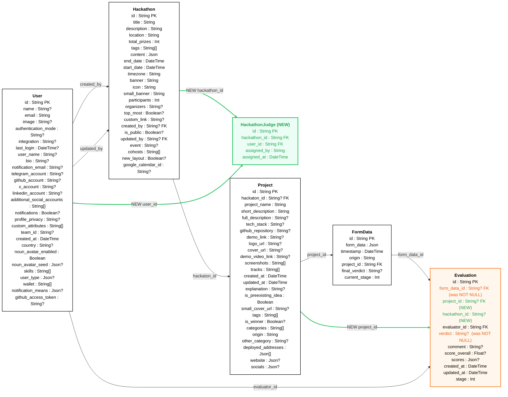

<!-- schema-erd:start -->
## Schema Changes

_Auto-generated 2026-05-14 — `feat/standardize-evaluate-hackathon` vs `ece1b723390c`_

> Legend: **black** = existing · **green** = added · **orange** = changed

### Summary

- ✚ **Added tables**: `HackathonJudge`
- ⚠️ **Changed tables**: `Evaluation`

#### `Evaluation` — field deltas

| Field | Before | After | Change |
|---|---|---|---|
| `project_id` | — | `project_id    String?` | ✚ added |
| `hackathon_id` | — | `hackathon_id  String?` | ✚ added |
| `form_data_id` | `form_data_id  String` | `form_data_id  String?` | ⚠️ (was NOT NULL) |
| `verdict` | `verdict       String` | `verdict       String?` | ⚠️ (was NOT NULL) |

#### `HackathonJudge` — new table

| Field | Definition |
|---|---|
| `id` | `id            String    @id @default(uuid())` |
| `hackathon_id` | `hackathon_id  String` |
| `user_id` | `user_id       String` |
| `assigned_by` | `assigned_by   String` |
| `assigned_at` | `assigned_at   DateTime  @default(now()) @db.Timestamptz(3)` |

<!-- schema-erd:end -->
